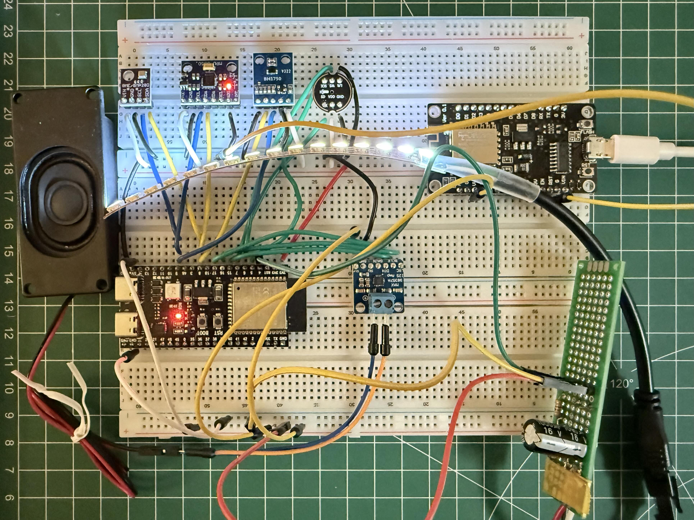

# Creature

An experiment in building a small artificial organism, not an AI assistant.

Live dashboard: https://basicchaos.com/creature/index.html

<p align="center">

</p>

## What it is

Creature is a persistent entity that senses its room, builds internal state from
what it senses, expresses that state through light and sound, and carries its
history forward as it grows. It has no goals, no chat, no task to complete. The
point is the architecture, not intelligence.

The bet underneath the project: persistent pressure on a connected field of cells
grows stable structure over time, and that structure is the memory. The work is to
find out whether a small field can stay differentiated and alive instead of
decaying to a flat, even, quiet state. Entropy is the real enemy.

## How it works

The Creature has a body and a mind, and they are kept separate on purpose.

The body is an ESP32-S3. It reads its senses about ten times a second, streams one
JSON line per sample, and waits for commands telling its emitters what to do. It
stores nothing and decides nothing.

The mind runs on a Raspberry Pi. A single loop reads each sample, normalizes every
sense to a 0 to 1 value that adapts to the room, steps the cell field once a
second, reads the emitter cells back out, and sends the matching light and sound
frames to the body. It writes a live snapshot for the dashboard and a history row
to disk.

The loop is the current centerpiece. A light sensor is placed where it can see the
strip, and the microphone where it can hear the speaker, so the Creature's own
output returns as input. When it lights up, it sees its own light. When it sounds,
it hears itself. Action causes sensing. That is what lets it generate its own
activity instead of waiting for the room to hand it some.

## Hardware overview

Body node: ESP32-S3-DevKitC-1 (N8R8) on a breadboard.

Senses:

- BH1750 ambient light (I2C)
- INMP441 MEMS microphone (I2S)
- MPU-6050 / ICM-20689 motion (I2C)
- BME280 temperature and pressure, a slow sense with a real day-night rhythm (I2C)

Emitters:

- SK6812 RGBW strip, about 16 pixels, the Creature's skin and face
- MAX98357A amplifier and a small speaker, its voice
- Onboard NeoPixel as a status pixel

Mind node: Raspberry Pi 3 B+. Runs the collector, the field, persistence, the
SQLite history, and the dashboard server. The Mac is only used for editing and
Git and is not part of the runtime.

Observation surface: a Linux VPS hosts a static mirror of the dashboard at
basicchaos.com. The Pi only sends an outbound copy to it. The VPS cannot reach
back in. Full pin assignments, power, and wiring notes live in
`Hardware/Creature v06/WIRING v06.md`.

## Hardware evolutions

- v01: first schematic and layout, captured in KiCad.
- v05: ESP on a breadboard with the INMP441 microphone and BH1750 light sensor.
  The early photoresistor divider was retired.
- v06: added the BME280 weather sensor, the motion IMU, the MAX98357A amplifier
  with a speaker, and the SK6812 RGBW strip. The microphone moved to its own I2S
  peripheral so the mic and amplifier never share pins.

Each version keeps its own schematic, wiring, and bench notes under `Hardware/`.

## Software evolutions

The mind is where most of the iteration happens. The body has stayed close to the
same on purpose so the field can change without rewriting hardware.

- Early experiments: an ESP32 light-novelty detector with Python collection.
- A 3-cell network of arousal, fatigue, and tonic state.
- An 11-cell ring.
- The 111-cell field (v05.4): a flat sheet of tissue with leaky-integrator cells,
  a shared energy metabolism, Hebbian learning with a scar floor, and triggered
  sleep and consolidation. It worked, but a big field of simple cells homogenizes.
  Adding cells only added more tissue to go uniform.
- v06: the current direction. The field shrank to a ring of twelve cells, with a
  six-cell fixed reservoir on the inside for temporal memory and a trained linear
  readout driving the two emitters. The cell changed from a leaky integrator to a
  predictive cell that reports surprise instead of raw input, so it stays
  differentiated under steady input. An expression decoder turns field state into
  strip color and voice.
- v06.5 / v06.6: an expression-as-memory layer. The Creature keeps an
  autobiography of what it expressed, and that graph can tell two different lives
  apart. A closed-loop dark-room probe showed the looped, curious Creature staying
  active in a silent, dark room where the same Creature without the loop goes flat.

The current running version string is `v06.6-predictive`.

## Status

The v06 brain is validated in simulation. Every build step passed a reproducible
gate with a fixed seed: the ring shapes structure and survives a simulated night,
the reservoir distinguishes histories, the readout beats a direct connection, the
predictive cell does not flatten, and the dark-room loop self-sustains. The
expression-memory record layer is live in the runtime.

The next phase is hardware: place the two loop sensors physically, wire the
curiosity drive and forward model into the firmware and collector, and run the
dark-room test on the real Creature. The one blocker is power. That work waits on
the battery path going in.

## Repository layout

```
Code/
  Firmware/esp-creature-core/   ESP32-S3 body (PlatformIO), 10 Hz JSON
  Firmware/bench/               per-sensor bring-up sketches
  Python/
    collector/                  the runtime loop on the Pi
    mind/                       the cell field, reservoir, predictive cell, decoder
    dashboard/                  server, page, static export, VPS sync
    tools/                      offline replay and gate harness
Hardware/                       KiCad schematics, wiring, bench notes, photos
```

## Documents

- `Creature Project Design Document Active.md`: the canonical design, current
  architecture in full.
- `Creature v06.md`: the v06 design rationale.
- `CREATURE_v06_SOFTWARE_RESULTS.md` and
  `CREATURE_v06_EXPRESSION_AND_LOOP_RESULTS.md`: the simulation results logs.
- `Creature v07 Hardware Potential.md`: the hardware roadmap.

## License

MIT. See `LICENSE`.
